# ❣️WordMasterProject❣️
#### 실전프로젝트1 - Project 1 (영어단어장 프로젝트)

 ❤️ 단어추가
 

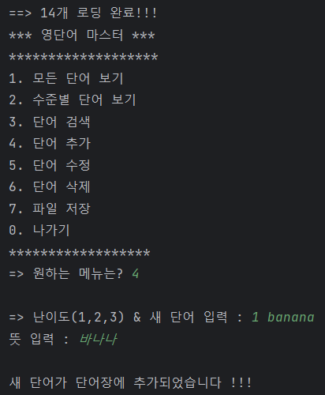 
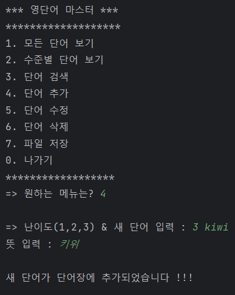

 💛 단어목록
  
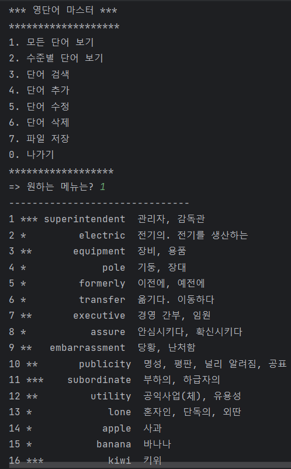

 💚 수준별 단어보기
  
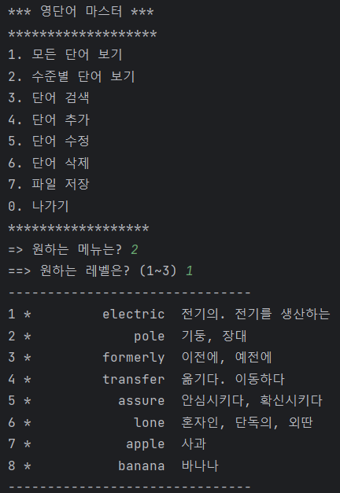

 💙 단어검색
  
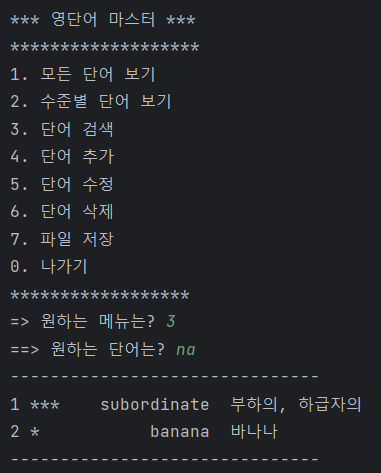

 💜 단어수정
 

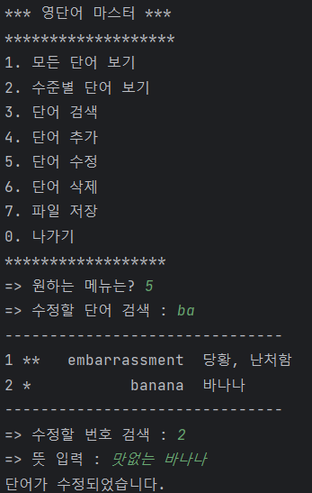 
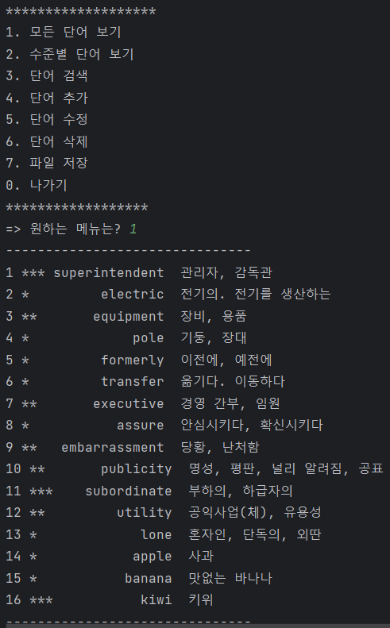

 🤎 단어삭제
 

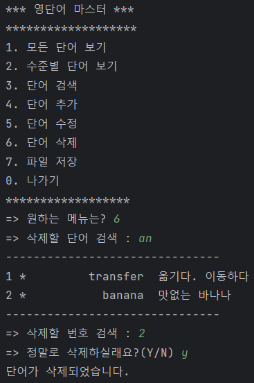 
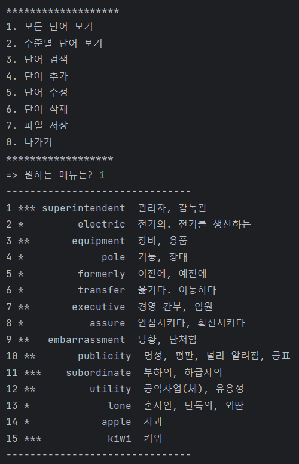

 🖤 파일저장 (Dictionary.txt)
 
 
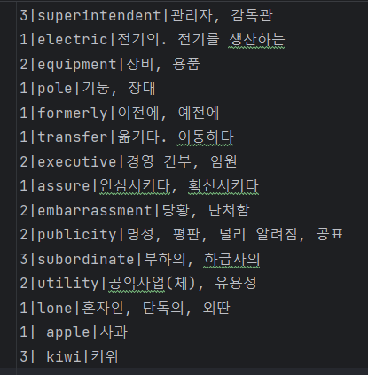

 🤍 프로그램 종료
 
 
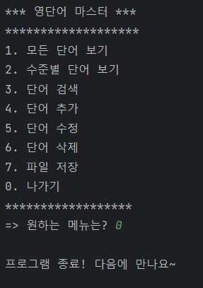

